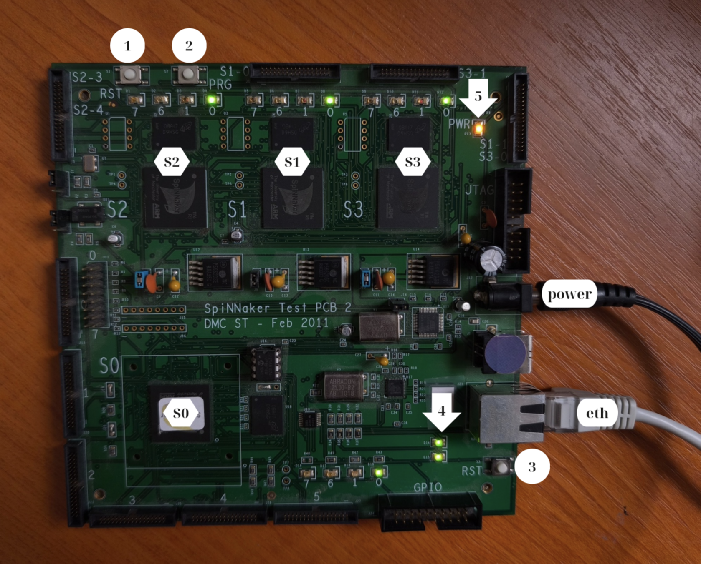
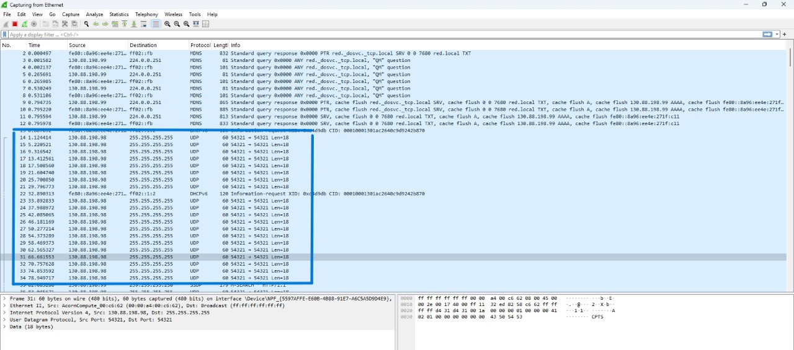

This tutorial is based on the [PyNN on SpiNNaker installation guide](https://spinnakermanchester.github.io/spynnaker/8.0.0/PyNNOnSpinnakerInstall.html#LocalBoard) from University of Manchester
# About the SpiNN-3 SpiNNaker Board


- **S0: root chip** which is directly connected to the Ethernet controller. It is the entry point for communication between your host computer and the SpiNNaker machine. Runs SCAMP (SpiNNaker Control and Monitor Program, manages loading binaries, gathering data etc.)
- **S1-S3: secondary chips**. These computational chips do not have direct Ethernet access and cannot boot on their own. They are connected to S0 and to each other; once S0 boots successfully, it will boot S1–S3 via the SpiNNaker mesh network.
- **chip LEDs**: each chip has four small LEDs (labeled 7, 6, 1, 0) located near the chip itself.
  Either:
  - These LEDs indicate activity on specific processor cores within that chip. Core 0 is the main core in the chip, so when the chip is active the ACT 0 LED will blink. Other LEDs which are indicating core indexes 1, 6, and 7 might blink when correspondive cores are active during a simulation. You can find these LEDs arranged around each chip, often just beside the SpiNNaker chip package. Their activity helps visually monitor whether the chip is active and which cores are being used at runtime. (DONE try to load cores 1 6 and 7 to confirm, failed. The second variant is more realistic)
  - These LEDs are link status indicators. The LEDs indicate the status of the inter-chip communication links 0, 1, 6 and 7 because they are likely the ones that are most critical for the board's operation.

     - Green LED: Link is active and functioning properly 
     - Red LED: Link error or fault condition 
     - Off: Link is inactive or not connected 
     - Blinking: Data transmission activity on that link 

- **1** partial reset?
- **2: PRG button** used to put the board into programming mode. When pressed, it enables the board to enter a state that allows new firmware or software to be uploaded.
- **3** full reset?
- **4: Ethernet Status LEDs**. Indicates whether the cable is connected and the board detects the network.
- **5: PWR LED.** Indicates whether the board is receiving power.
- **eth: Ethernet connector**
- **power: Power input connector**

# Installation
Note: As [PyNN on SpiNNaker installation guide](https://spinnakermanchester.github.io/spynnaker/8.0.0/PyNNOnSpinnakerInstall.html#LocalBoard) states, 
> Full testing is done using Ubuntu 22.04 and Python 3.12 so these are our recommendations.

Let's start with setting up the virtual environment.
```bash
cd your/project
```
```bash
python -m venv .venv
```
```bash
.venv\Scripts\activate # Windows command prompt
```
```bash
source .venv/bin/activate # Linux/macOS
```
You should now see the environment name in your terminal prompt, like:
```bash
(.venv) D:\your\project>
```


Use the package manager [pip](https://pip.pypa.io/en/stable/) to install required packages.

```bash
# if you had them installed before
pip uninstall pyNN-SpiNNaker
pip uninstall sPyNNaker

pip install matplotlib
```
Install sPyNNaker:

```bash
pip install sPyNNaker
```

Install pyNN-SpiNNaker:
```bash
python -m spynnaker.pyNN.setup_pynn
```


## Configuration 

Please follow the configuration part of the [PyNN on SpiNNaker installation guide](https://spinnakermanchester.github.io/spynnaker/8.0.0/PyNNOnSpinnakerInstall.html#LocalBoard) from Manchester University. When you are done, check the connection by using ICMP echo request:
```bash
ping [your board's IP]
```

Make sure you actually know your board's IP address! The default IP address for a spinn-3 board is **192.168.240.253** and for a spinn-5 board is **192.168.240.1**, however, this is not guaranteed, as the board may have been reconfigured. **!!The board in our lab is on the 130.88.198.98**!!. If the default address configuration throws errors and
board is not reachable by ping, after connecting the board to your computer via Ethernet, check your ARP table to see if the board's MAC and IP address appear to confirm whether the board is using the IP address you expect. 
```bash
arp -a
```
If the board's IP address is not the default one, configure your computer's Ethernet interface with a static IP in the same subnet. In this case it means matching the first three numbers and choosing an unused final digit - in this case **130.88.198.99**.

After power on or reset a SpiNNaker board, you might observe the board trying to communicate via its SCAMP boot protocol. If you capture the Ethernet traffic (for example using WireShark), you will likely see UDP packets broadcasted from board's IP. That is how the SpiNNaker is trying to communicate with a computer.
Below you can see an example of Ethernet traffic captured with WireShark. We can understand what the boards IP address is by analyzing the highlited UDP packets.



## Overview of the installed packages
Frozen environment of the installed packages with their versions that worked for me.
**- Python 3.12 -**
```bash
appdirs==1.4.4 
attrs==25.3.0
certifi==2025.7.14
charset-normalizer==3.4.2
colorama==0.4.6
contourpy==1.3.3
csa==0.1.12
cycler==0.12.1
Deprecated==1.2.18
ebrains-drive==0.6.0
fonttools==4.59.0
h5py==3.14.0
idna==3.10
jsonschema==4.25.0
jsonschema-specifications==2025.4.1
kiwisolver==1.4.8
lazyarray==0.6.0
matplotlib==3.10.3
morphio==3.4.0
neo==0.14.2
numpy==2.3.2
packaging==25.0
pillow==11.3.0
PyNN==0.12.4
pyparsing==3.2.3
python-dateutil==2.9.0.post0
PyYAML==6.0.2
quantities==0.16.2
referencing==0.36.2
requests==2.32.4
rpds-py==0.26.0
scipy==1.16.1
setuptools==80.9.0
six==1.17.0
spalloc==1!7.3.0
SpiNNaker_PACMAN==1!7.3.0
SpiNNFrontEndCommon==1!7.3.0
SpiNNMachine==1!7.3.0
SpiNNMan==1!7.3.0
SpiNNUtilities==1!7.3.0
sPyNNaker==1!7.3.0
tqdm==4.67.1
typing_extensions==4.14.1
urllib3==2.5.0
websocket-client==1.8.0
wheel==0.45.1
wrapt==1.17.2
```
