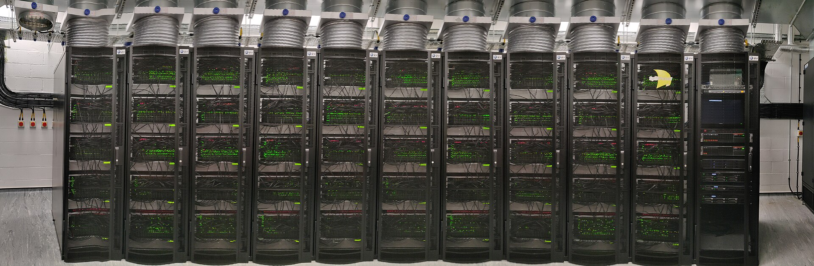
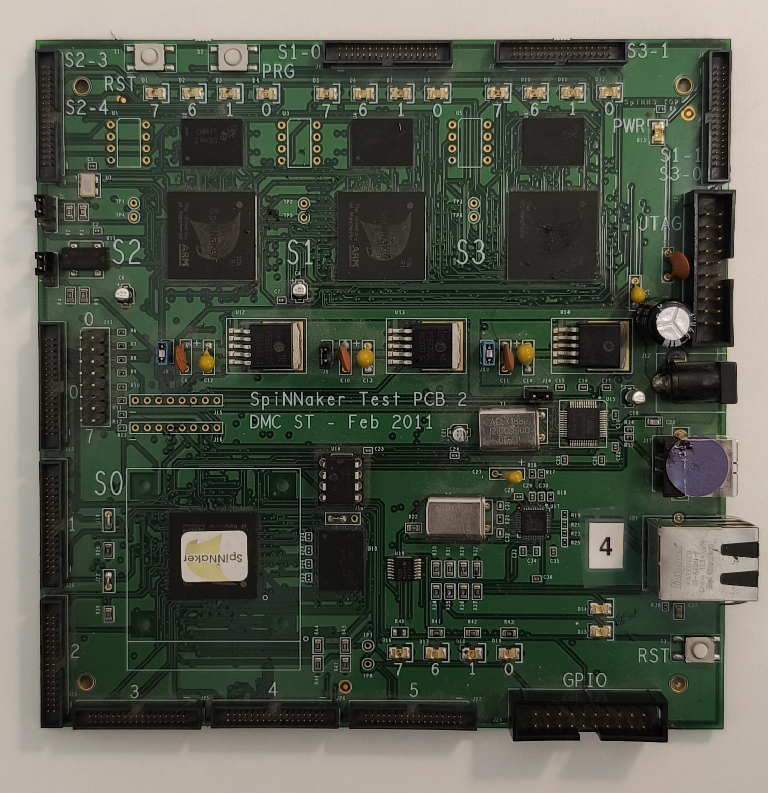
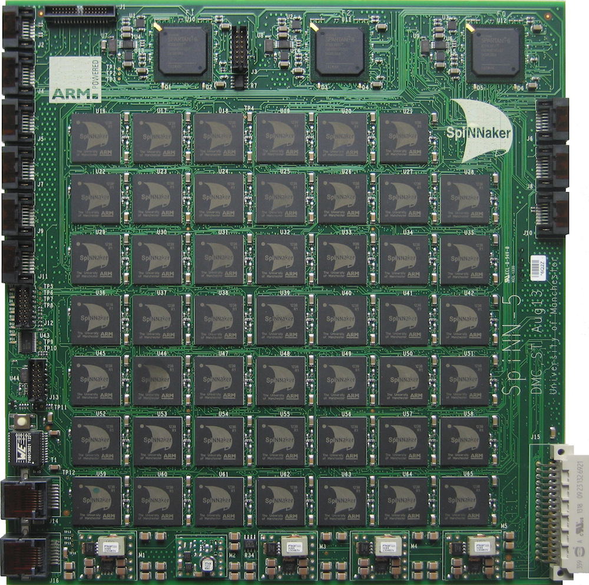

# About the SpiNNaker Boards
SpiNNaker (or SpiNN) is a neuromorphic computing platform developed at the University of Manchester for real-time simulation of spiking neural networks (SNNs). The architecture is designed to emulate biological neural systems using parallel, low-power processing cores.

SpiNNaker platform is built from many identical **SpiNNaker chips**, each integrating 18 ARM cores and a dedicated communication infrastructure. These chips are assembled into boards, with SpiNN-3 and SpiNN-5 representing two key hardware configurations differing primarily in scale and intended use cases. A single SpiNNaker chip can perform up to 3.6 billion simple operations per second *consuming only 1 Watt of electrical power* [[1]](https://pure.manchester.ac.uk/ws/files/51830495/High_Performance_Computing_on_SpiNNaker_Neuromorphic_Platform_a_Case_Study_for_Energy_Efficient_Image_Processin.pdf?utm_source=chatgpt.com), enabling the deployment of complex neural simulations in power-constrained environments such as embedded and robotic systems.

At a larger scale, multiple SpiNN boards can be interconnected to form a **SpiNNaker machine**, supporting simulations of significantly greater complexity. The most prominent example is the world’s largest neuromorphic computing SpiNNaker system developed at the University of Manchester (Fig.1), which consists of 1,036,800 cores interconnected through a high-speed communication network [[2]](https://www.researchgate.net/publication/340985777_spiNNlink_FPGA-Based_Interconnect_for_the_Million-Core_SpiNNaker_System), reaching over 7 TB of RAM. This system is constructed by assembling numerous SpiNN-5 boards into racks, creating a highly scalable computing platform. In terms of simulation capacity, it was designed to model up to approximately one billion (10⁹) neurons and one trillion (10¹²) synapses in real time [[3]](https://doi.org/10.3389/fnins.2018.00816), placing it above the neuronal scale of small mammalian brains such as that of the mouse (≈10⁸ neurons), while still representing only about 1% of the human brain (≈8.6 × 10¹⁰ neurons).


SpiNNaker machine of University of Manchester can be accessed through the [EBRAINS Collaboratory](https://wiki.ebrains.eu/bin/view/Collabs/neuromorphic/SpiNNaker/), where computational resources are exposed via Jupyter Notebook environments accessible directly in a web browser through the “Lab” interface.


*Fig.1) The SpiNNaker machine, world's largest neuromorphic computing platform, originated and hosted at The University of Manchester. Developed by the Advanced Processor Technologies Research Group, this supercomputer incorporates over one million ARM processor cores to simulate biological brain circuits in real time. Source: [HBP Neuromorphic Computing Platform Guidebook](https://electronicvisions.github.io/hbp-sp9-guidebook/mc/mc_index.html)*

# Local SpiNN Boards

Within the Neuro-Inspired Perception and Cognition research group, two SpiNNaker platforms are available for use: the SpiNN-3 and SpiNN-5 boards, representing different scales of neuromorphic architecture and enabling a range of neuromorphic computing experiments. The **SpiNN-3 board** is a compact, low-power platform composed of four interconnected SpiNNaker chips, making it suitable for small-scale neural simulations. In contrast, the **SpiNN-5** board provides a significantly larger computational resource, consisting of 48 chips and incorporating FPGA-based communication interfaces, which allow for higher scalability and integration of deeper neural networks.

## SpiNN-3

<p align="center">
  
</p>
*Fig.2) The SpiNN-3 neuromorphic computing board used within Neuro-Inspired Perception and Cognition research group. This prototype dated February 2011 houses four SpiNNaker processor chips.*

### Board structure:
- **S0: root chip** which is directly connected to the Ethernet controller. It is the entry point for communication between the host computer and the SpiNN board, runs SCAMP (SpiNNaker Control and Monitor Program), manages loading binaries, gathering data etc.
- **S1-S3: secondary chips**. These computational chips do not have direct Ethernet access and cannot boot on their own. They are connected to S0 and to each other; once S0 boots successfully, it will boot S1–S3 via the SpiNNaker mesh network.
- **Chip LEDs**: each chip has four small LEDs (labeled 7, 6, 1, 0) located near the chip itself.
     - Green LED: Link is active and functioning properly 
     - Red LED: Link error or fault condition 
     - Blinking: Data transmission activity on that link 

- **PRG button** (left upper corner) used to put the board into programming mode. When pressed, it enables the board to enter a state that allows new firmware or software to be uploaded.
- **PWR LED** (right upper corner) indicates whether the board is receiving power.
- **Ethernet Status LEDs** (under sticker with number 4) indicate whether the cable is connected and the board detects the network. Important: directly under the Ethernet connector there are additional network activity LEDs. A blinking green LED indicates active data transmission between the host computer and the board.
- **Ethernet connector**, the main communication channel between board and a host computer, used for control, booting, and data transfer.
- **Power input connector**, supplies electrical power to the board.
- **RST** button near Ethernet connector performs a hardware reset of the board, useful for restarting the system without power cycling.

Before starting work, ensure that both the power supply and Ethernet cables are properly connected.
To restart the board, press and hold the reset button for a few seconds, then wait until all chips have fully booted (indicated by green LEDs on the chips).

There is an [Official brief introduction to the SpiNN-3 Board](https://spinnakermanchester.github.io/docs/spinn-app-1.pdf?) available, however the board layout can differ.
## SpiNN-5


*Fig.3) SpiNN-5 board, the standard building block of a large-scale SpiNNaker neuromorphic system. Featuring 48 SpiNNaker chips interconnected in a mesh topology where each chip connects to six neighbors, it provides a total of 864 ARM cores across the board. Source: [Ebrains Collaboratory](https://wiki.ebrains.eu/bin/view/Collabs/neuromorphic/SpiNNaker/#Information)*

### Board structure:
...

There is an [Official Quick Start Guide for the SpiNN-5 Platform](https://spinnakermanchester.github.io/docs/spinn-app-9.pdf) that quickly introduces the board and contain useful Power-Up and Troubleshooting guide.

## Installation
The setup procedure is based on the guidelines provided in the [PyNN on SpiNNaker installation guide](https://spinnakermanchester.github.io/spynnaker/8.0.0/PyNNOnSpinnakerInstall.html#LocalBoard).
 

Start with setting up the virtual environment. **Python 3.12** is recommended
```bash
cd your/project
python -m venv .venv
.venv\Scripts\activate # Windows command prompt
source .venv/bin/activate # Linux/macOS
```
You should now see the environment name in your terminal prompt, like:
```bash
(.venv) D:\your\project>
```


Use the package manager [pip](https://pip.pypa.io/en/stable/) to install required packages.

**PyNN** is a Python interface for defining spiking neural network models in a standardized way. It provides a common API that allows the same neural model to be executed on different backends without modifying the model definition. **sPyNNaker is the SpiNNaker implementation of PyNN**. It enables the execution of PyNN-defined spiking neural network models directly on SpiNNaker hardware by translating high-level network descriptions into executable code for the SpiNNaker architecture.


```bash
# if you had them installed before
pip uninstall pyNN-SpiNNaker
pip uninstall sPyNNaker
```
```bash
pip install sPyNNaker
python -m spynnaker.pyNN.setup_pynn
```


## Configuration file setup

This follows the configuration part of the [PyNN on SpiNNaker installation guide](https://spinnakermanchester.github.io/spynnaker/8.0.0/PyNNOnSpinnakerInstall.html#LocalBoard).

When sPyNNaker is executed for the first time, it automatically checks for an existing configuration file. To manually trigger the creation of this configuration file before running a simulation, the following Python script can be executed:

```python
import pyNN.spiNNaker as sim
sim.setup()
sim.end()
```
This will generate a file named `.spynnaker.cfg` in the home directory; note that on some operating systems, files starting with a dot are hidden by default.

After opening `.spynnaker.cfg`, locate the following section:

```python
[Machine]
machineName = None
version = None
```
And update this configuration by setting the appropriate machine address and type:

#### SpiNN-3
```python
[Machine]
machineName = 130.88.198.98
version = 3
```
#### SpiNN-5
```python
[Machine]
machineName = 192.168.240.1
version = 5
```
## Network Configuration
In order to establish communication with the SpiNNaker board, it is necessary to define a local network range in which devices can directly communicate and configure the host computer’s network interface appropriately. 
**The Ethernet interface of the host computer must then be assigned a static IP address within the same subnet as the SpiNNaker board:**
#### SpiNN-3
```python
ip addr - 130.88.198.99
subnet mask - 255.255.255.0
```
#### SpiNN-5
```python
ip addr - 192.168.240.2
subnet mask - 255.255.255.0
```

Check the connection by using ICMP echo request:
```
ping [board's IP]
```
A successful response confirms that the system is correctly configured and ready for use, allowing simulations and further interaction with the SpiNNaker platform to proceed.

## Troubleshooting 

- Before executing custom simulations, it is recommended to first run a set of example scripts, such as those available in the [SpiNNaker PyNNExamples repository](https://github.com/SpiNNakerManchester/PyNNExamples
). If errors occur, it is important to analyze the output messages and logs before proceeding, as identifying the stage at which the error arises (e.g., configuration, loading, execution, or communication) is essential for effective debugging and resolution.
- Ensure that the plastic retaining clips on the Ethernet connectors are intact on both ends, as a damaged clip may result in an unstable connection even if the cable appears to be properly inserted.

#### SpiNN-3
- Verify that each chip indicates normal operation by showing at least one blinking green LED. If any red LEDs are observed, this may indicate a fault or link error; in such cases, perform a hardware reset by pressing and holding the reset button for a few seconds, and allow the board to reboot fully before proceeding.

#### SpiNN-5
- Ensure that no additional interconnect cables are attached to the board unless explicitly required. Unintended connections between communication links may introduce loops in the SpiNNaker network topology, leading to packet circulation, routing instability, or communication failures during operation.


***
Versions of the common packages for **Python 3.12** that was used with SpiNNaker boards in group's research can be found below.

```bash
matplotlib==3.10.3
numpy==2.3.2
PyNN==0.12.4
scipy==1.16.1
SpiNNaker_PACMAN==1!7.3.0
SpiNNFrontEndCommon==1!7.3.0
SpiNNMachine==1!7.3.0
SpiNNMan==1!7.3.0
SpiNNUtilities==1!7.3.0
sPyNNaker==1!7.3.0
```

## Useful links
[PyNN documentation](https://neuralensemble.org/docs/PyNN/)  
[sPyNNaker documentation](https://spynnaker.readthedocs.io/en/latest/)  
[sPyNNaker source code](https://github.com/SpiNNakerManchester/sPyNNaker)  

[SpiNNaker technical documents](https://spinnakermanchester.github.io/docs/)  
[SpiNNaker online software documentation](https://spinnakermanchester.github.io/)  
[SpiNNaker support - Google group](https://groups.google.com/u/0/g/spinnakerusers)

[HBP Neuromorphic Computing Platform Guidebook](https://electronicvisions.github.io/hbp-sp9-guidebook/)


## References

[1] SUGIARTO, I.; LIU, G.; DAVIDSON, S.; PLANA, L. A.; FURBER, S. B. High performance computing on SpiNNaker neuromorphic platform: A case study for energy efficient image processing. In: *2016 IEEE 35th International Performance Computing and Communications Conference (IPCCC)*. 2016, pp. 1–8. Available from doi: [10.1109/PCCC.2016.7820645](https://doi.org/10.1109/PCCC.2016.7820645).  

[2] PLANA, L. A.; GARSIDE, J.; HEATHCOTE, J.; PEPPER, J.; TEMPLE, S.; DAVIDSON, S.; LUJÁN, M.; FURBER, S. B. SpiNNlink: FPGA-Based Interconnect for the Million-Core SpiNNaker System. *IEEE Access*. 2020, pp. 1–1. Available from doi: [10.1109/ACCESS.2020.2991038](https://doi.org/10.1109/ACCESS.2020.2991038). 

[3] RHODES, O.; BOGDAN, P. A.; BRENNINKMEIJER, C.; DAVIDSON, S.; FELLOWS, D.; GAIT, A.; LESTER, D. R.; MIKAITIS, M.; PLANA, L. A.; ROWLEY, A. G. D.; STOKES, A. B.; FURBER, S. B. sPyNNaker: A Software Package for Running PyNN Simulations on SpiNNaker. *Frontiers in Neuroscience*. 2018, vol. 12, p. 816. Available from doi: [10.3389/fnins.2018.00816](https://doi.org/10.3389/fnins.2018.00816).

